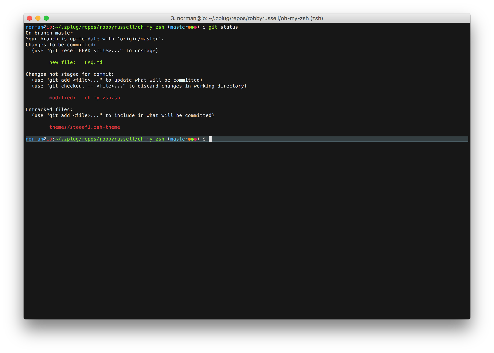

# stiiif
My single-line adoption of the [oh-my-zh/steeef](https://github.com/robbyrussell/oh-my-zsh/blob/master/themes/steeef.zsh-theme) theme

### Modifications

- single line prompt
- less words (`at`, `in`), using symbols (`@`, `:`) instead
- slightly different, brighter colors


### Screenshot




### Installation

#### zplug

```
zplug "norman-thomas/stiiif", use:"stiiif.zsh-theme", as:theme
```
